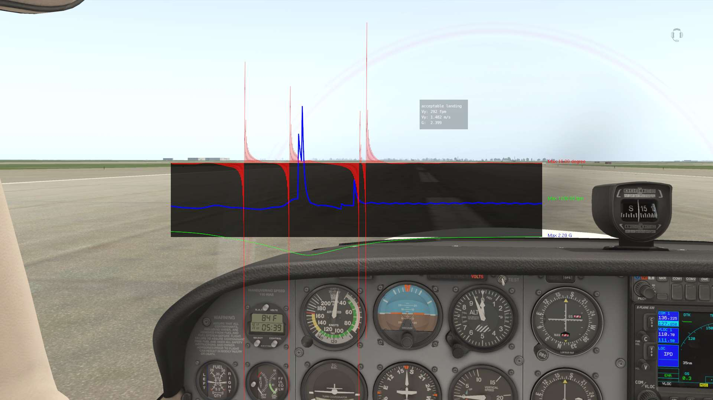
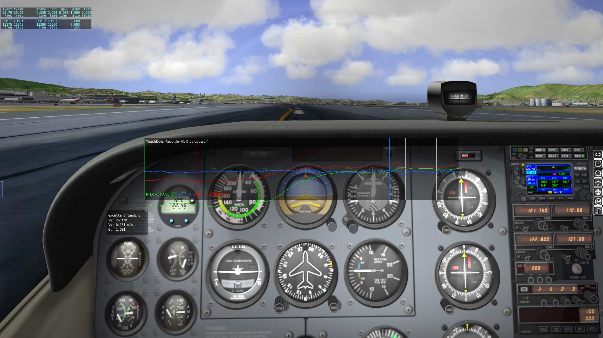

# TouchDownRecorder
X-Plane 10/11 aircraft landing touch down flight recorder

it is used for aircraft landing data analysis

TouchDownRecorder .lua scripts is based on FlyWithLua plugin for X-Plane

## Screenshot on X-Plane 11 ##

## Screenshot on X-Plane 10 ##

